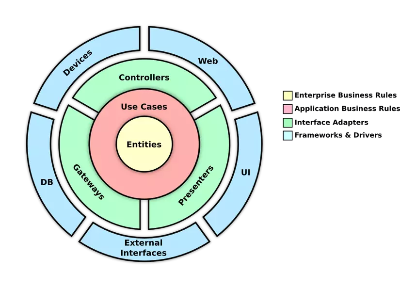

 Clean Architecture C# Web API - Cấu trúc Dự Án

## Tổng Quan Kiến Trúc

Clean Architecture được tổ chức thành các layer độc lập, với dependencies luôn hướng vào trong (từ ngoài vào core):

```
YourProject/
│── YourProject.Domain/              # Core/Entities Layer
│── YourProject.Application/         # Use Cases Layer
│── YourProject.Infrastructure/      # Infrastructure Layer
│── YourProject.WebApi/             # Presentation Layer
├── .gitignore
├── README.md
└── YourProject.sln
```

## 1. Domain Layer (YourProject.Domain)

**Không phụ thuộc vào layer nào khác**

```
YourProject.Domain/
├── Entities/
│   │── BaseEntity.cs
│   ├── Entiry1.cs
│   ├── Entiry2.cs
│   └── YourProjectDbContext
├── Enums/
│   ├── OrderStatus.cs
│   └── UserRole.cs
├── Events/
│   ├── DomainEvent.cs
│   ├── OrderCreatedEvent.cs
│   └── UserRegisteredEvent.cs
├── Exceptions/
│   ├── DomainException.cs
│   └── BusinessRuleValidationException.cs
└── Interfaces/
    └── IUnitOfWork.cs
```

**Ví dụ Entity:**
```csharp
public class Product : BaseEntity
{
    public string Name { get; set { validate nếu có (lỗi thì throw DataExcaption)} }
}
```

---

## 2. Application Layer (YourProject.Application)

**Phụ thuộc vào: Domain**

```
YourProject.Application/
├── Common/
│   ├── Behaviours/
│   │   ├── ValidationBehaviour.cs
│   │   ├── LoggingBehaviour.cs
│   │   └── TransactionBehaviour.cs
│   ├── Interfaces/
│   │   ├── IApplicationDbContext.cs
│   │   ├── IDateTime.cs
│   │   ├── ICurrentUserService.cs
│   │   └── IEmailService.cs
│   ├── Models/
│   │   ├── Result.cs
│   │   ├── PaginatedList.cs
│   │   └── ValidationError.cs
│   └── Mappings/
│       └── MappingProfile.cs
├── Features/
│   ├── Users/
│   │   ├── Commands/
│   │   │   ├── CreateUser/
│   │   │   │   ├── CreateUserCommand.cs
│   │   │   │   ├── CreateUserCommandValidator.cs
│   │   │   │   └── CreateUserCommandHandler.cs
│   │   │   └── UpdateUser/
│   │   └── Queries/
│   │       ├── GetUserById/
│   │       │   ├── GetUserByIdQuery.cs
│   │       │   └── GetUserByIdQueryHandler.cs
│   │       └── GetUsersList/
│   ├── Products/
│   └── Orders/
├── DTOs/
│   ├── UserDto.cs
│   ├── ProductDto.cs
│   └── OrderDto.cs
└── DependencyInjection.cs
```

**Ví dụ CQRS Command:**
```csharp
public class CreateUserCommand : IRequest<Result<int>>
{
    public string Email { get; set; }
    public string FullName { get; set; }
}

public class CreateUserCommandHandler : IRequestHandler<CreateUserCommand, Result<int>>
{
    private readonly IApplicationDbContext _context;
    
    public async Task<Result<int>> Handle(CreateUserCommand request, CancellationToken ct)
    {
        var user = new User(request.Email, request.FullName);
        _context.Users.Add(user);
        await _context.SaveChangesAsync(ct);
        return Result<int>.Success(user.Id);
    }
}
```

---

## 3. Infrastructure Layer (YourProject.Infrastructure)

**Phụ thuộc vào: Domain, Application**

```
YourProject.Infrastructure/
├── Persistence/
│   ├── Configurations/
│   │   ├── UserConfiguration.cs
│   │   ├── ProductConfiguration.cs
│   │   └── OrderConfiguration.cs
│   ├── Migrations/
│   ├── Interceptors/
│   │   ├── AuditableEntityInterceptor.cs
│   │   └── SoftDeleteInterceptor.cs
│   ├── ApplicationDbContext.cs
│   └── UnitOfWork.cs
├── Repositories/
│   ├── Base/
│   │   ├── IRepository.cs
│   │   └── Repository.cs
│   ├── UserRepository.cs
│   └── ProductRepository.cs
├── Identity/
│   ├── IdentityService.cs
│   └── CurrentUserService.cs
├── Services/
│   ├── DateTimeService.cs
│   ├── EmailService.cs
│   └── FileStorageService.cs
├── External/
│   ├── PaymentService.cs
│   └── SmsService.cs
└── DependencyInjection.cs
```

**Ví dụ DbContext Configuration:**
```csharp
public class UserConfiguration : IEntityTypeConfiguration<User>
{
    public void Configure(EntityTypeBuilder<User> builder)
    {
        builder.HasKey(u => u.Id);
        builder.Property(u => u.Email).IsRequired().HasMaxLength(256);
        builder.OwnsOne(u => u.Address);
    }
}
```

---

## 4. Web API Layer (YourProject.WebApi)

**Phụ thuộc vào: Application, Infrastructure**

```
YourProject.WebApi/
├── Controllers/
│   ├── BaseApiController.cs
│   ├── UsersController.cs
│   ├── ProductsController.cs
│   └── OrdersController.cs
├── Filters/
│   ├── ApiExceptionFilterAttribute.cs
│   └── ValidateModelStateAttribute.cs
├── Middleware/
│   ├── ExceptionHandlingMiddleware.cs
│   ├── RequestLoggingMiddleware.cs
│   └── PerformanceMiddleware.cs
├── Extensions/
│   ├── ServiceCollectionExtensions.cs
│   └── ApplicationBuilderExtensions.cs
├── Models/
│   ├── ApiResponse.cs
│   └── ErrorDetails.cs
├── appsettings.json
├── appsettings.Development.json
├── Program.cs
└── Startup.cs (nếu dùng .NET 6 trở xuống)
```

**Ví dụ Controller:**
```csharp
[ApiController]
[Route("api/[controller]")]
public class UsersController : BaseApiController
{
    [HttpPost]
    [ProducesResponseType(StatusCodes.Status201Created)]
    public async Task<ActionResult<int>> Create(CreateUserCommand command)
    {
        var result = await Mediator.Send(command);
        return result.Succeeded 
            ? CreatedAtAction(nameof(GetById), new { id = result.Data }, result.Data)
            : BadRequest(result);
    }

    [HttpGet("{id}")]
    public async Task<ActionResult<UserDto>> GetById(int id)
    {
        var result = await Mediator.Send(new GetUserByIdQuery { Id = id });
        return result.Succeeded ? Ok(result.Data) : NotFound();
    }
}
```

---

## Cấu Hình Dependencies

**Program.cs:**
```csharp
var builder = WebApplication.CreateBuilder(args);

// Add layers
builder.Services.AddApplication();
builder.Services.AddInfrastructure(builder.Configuration);

// Add API services
builder.Services.AddControllers();
builder.Services.AddEndpointsApiExplorer();
builder.Services.AddSwaggerGen();

var app = builder.Build();

if (app.Environment.IsDevelopment())
{
    app.UseSwagger();
    app.UseSwaggerUI();
}

app.UseHttpsRedirection();
app.UseAuthentication();
app.UseAuthorization();
app.MapControllers();

app.Run();
```

---

## Packages Cần Thiết

### Domain Layer
- Không cần package bên ngoài (pure C#)

### Application Layer
```xml
<ItemGroup>
  <PackageReference Include="AutoMapper.Extensions.Microsoft.DependencyInjection" />
  <PackageReference Include="FluentValidation.DependencyInjectionExtensions" />
  <PackageReference Include="MediatR" />
</ItemGroup>
```

### Infrastructure Layer
```xml
<ItemGroup>
  <PackageReference Include="Microsoft.EntityFrameworkCore" />
  <PackageReference Include="Microsoft.EntityFrameworkCore.SqlServer" />
  <PackageReference Include="Microsoft.AspNetCore.Identity.EntityFrameworkCore" />
</ItemGroup>
```

### Web API Layer
```xml
<ItemGroup>
  <PackageReference Include="Swashbuckle.AspNetCore" />
  <PackageReference Include="Serilog.AspNetCore" />
</ItemGroup>
```

---

## Nguyên Tắc Quan Trọng

1. **Dependency Rule**: Dependencies luôn hướng vào trong (Domain không phụ thuộc gì)
2. **Separation of Concerns**: Mỗi layer có trách nhiệm riêng biệt
3. **Testability**: Dễ dàng test từng layer độc lập
4. **SOLID Principles**: Áp dụng xuyên suốt
5. **CQRS Pattern**: Tách biệt Command và Query
6. **Repository Pattern**: Abstraction cho data access
7. **Unit of Work**: Quản lý transactions